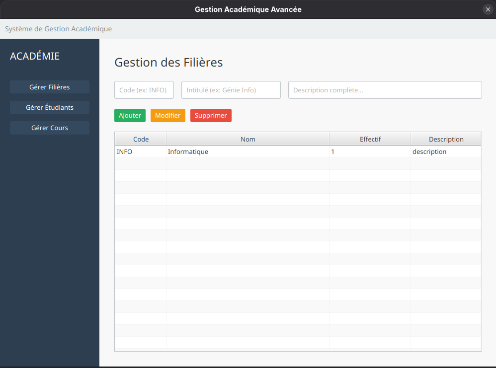
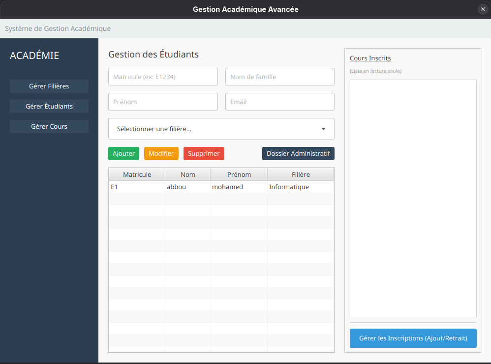

# Mini-Projet JavaFX : Gestion Académique Avancée

Ce projet est une application desktop de gestion académique développée en **JavaFX** avec une persistance des données via **JDBC** pur. Elle permet la gestion administrative des filières, des étudiants, des cours et des dossiers administratifs, en respectant des règles de gestion strictes et une architecture modulaire.

## 🏗 Architecture

Le projet respecte scrupuleusement l'architecture en couches imposée (MVC/DAO) :

* `ma.examen.model` : Classes POJO représentant les tables de la base de données (`Eleve`, `Filiere`, `Cours`, `DossierAdministratif`).
* `ma.examen.dao` : Couche d'accès aux données (Data Access Object). Gère toutes les requêtes SQL (CRUD, transactions, requêtes complexes).
* `ma.examen.controller` : Logique de présentation. Gère les interactions utilisateur, la validation des formulaires et le lien entre la Vue et le Modèle.
* `ma.examen.view` : Fichiers FXML définissant l'interface graphique.
* `ma.examen.util` : Utilitaires techniques, notamment le gestionnaire de connexion Singleton (`DBConnection`) qui charge la configuration depuis un fichier externe.

## 👁 Aperçu de l'Interface

### 1. Gestion des Filières

*Tableau de bord des filières avec calcul automatique de l'effectif étudiant.*



### 2. Gestion des Étudiants

*Vue complète permettant l'ajout, la modification et le filtrage des étudiants par filière.*



### 3. Gestion des Cours

*Interface de création, modification et affectation des cours aux différentes filières.*


### 4. Gestion des Inscriptions (Pop-up)

*Interface dédiée (Double List View) pour gérer les inscriptions aux cours : à gauche les cours disponibles, à droite les cours inscrits.*


## 🛠 Choix Techniques

### 1. Interface Utilisateur (JavaFX)

* **Expérience Utilisateur (UX) :** Les interfaces masquent les IDs techniques. Les formulaires utilisent des `ComboBox` pour les clés étrangères (ex: choix de la filière par nom).
* **Fenêtre d'Inscription Spécialisée :** Développement d'une vue dédiée (Double List View) pour gérer les inscriptions aux cours, permettant de visualiser clairement les cours disponibles vs inscrits.
* **Navigation :** Architecture "Single Window" avec un menu latéral pour une navigation fluide entre les modules.

### 2. Persistance (JDBC Pur)

* **Sécurité :** Utilisation systématique de `PreparedStatement` pour prévenir les injections SQL.
* **Performance :** Utilisation de requêtes optimisées (JOIN) pour récupérer les données liées en un seul appel (ex: liste des élèves avec le nom de leur filière).
* **Configuration Externe :** Les identifiants de connexion sont isolés dans un fichier `database.properties` pour faciliter le déploiement.

### 3. Gestion des Données

* **Transactions :** Les suppressions complexes (ex: supprimer un élève et ses inscriptions) et les ajouts massifs sont gérés dans des transactions (`commit`/`rollback`) pour garantir l'intégrité de la base.
* **Règles Métier :** Vérifications strictes implémentées (ex: un élève ne peut s'inscrire qu'aux cours de sa filière, unicité du dossier administratif).

## ⚠ Difficultés Rencontrées et Solutions

### 1. Contraintes de Clés Étrangères (FK)

* **Problème :** Impossibilité de supprimer une filière ou un élève si des données dépendantes existent (cours suivis, dossiers).
* **Solution :** Implémentation de méthodes de **suppression en cascade** transactionnelle dans les DAO. Avant de supprimer un parent, le DAO nettoie d'abord les enfants liés.

### 2. Filtrage des Inscriptions

* **Problème :** Lors de l'inscription d'un élève, il fallait afficher uniquement les cours de sa filière auxquels il n'était pas encore inscrit.
* **Solution :** Algorithme de filtrage dans le contrôleur : `Liste Disponible = (Cours de la Filière) - (Cours déjà Inscrits)`.

### 3. Actualisation des Vues

* **Problème :** L'interface ne se mettait pas toujours à jour après une modification en base de données.
* **Solution :** Mise en place d'observateurs (`Listeners`) sur les sélections et rechargement systématique des données (`loadData()`) après chaque opération CRUD.

## ▶ Installation et Lancement

### Prérequis

* Java JDK 17 ou supérieur
* Maven
* MySQL ou PostgreSQL

### Étapes d'installation

1. **Base de données :**
   Exécuter le script `script.sql` (situé à la racine du projet) dans votre outil de base de données pour créer les tables.
2. **Configuration :**
   Ouvrir le fichier `src/main/resources/database.properties` et modifier les identifiants selon votre configuration locale :
```properties
db.url=jdbc:mysql://localhost:3306/votre_base
db.user=votre_user
db.password=votre_password

```


3. **Lancement :**
   Ouvrir un terminal à la racine du projet et exécuter :
```bash
  mvn clean javafx:run
```